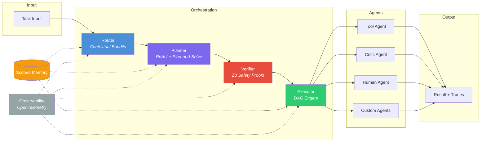

<div align="center">

<br>

# 🔷 Lattice

### Adaptive Multi-Agent Orchestration Framework

Route, plan, verify, and execute multi-agent workflows with learned routing, formal safety proofs, and full observability.

<br>

[](https://www.python.org/downloads/)
[](https://pytorch.org/)
[](https://github.com/Z3Prover/z3)
[](LICENSE)
[](https://github.com/JiwaniZakir/lattice/stargazers)
[](https://github.com/JiwaniZakir/lattice/network/members)

<br>

<p align="center">
  <a href="#-quick-start">Quick Start</a> &nbsp;&bull;&nbsp;
  <a href="#-architecture">Architecture</a> &nbsp;&bull;&nbsp;
  <a href="#-features">Features</a> &nbsp;&bull;&nbsp;
  <a href="#-benchmarks">Benchmarks</a> &nbsp;&bull;&nbsp;
  <a href="#-examples">Examples</a> &nbsp;&bull;&nbsp;
  <a href="#-contributing">Contributing</a>
</p>

<br>

</div>

---

## Overview

Lattice is a Python framework for building **multi-agent systems with formal safety guarantees**. It combines a contextual bandit router that learns optimal agent assignment from execution feedback, a hybrid ReAct + Plan-and-Solve planner for task decomposition, and a Z3-powered verifier that proves DAG acyclicity, budget feasibility, and capability constraints before any code executes. The result is a production-grade orchestration layer where agents are routed intelligently, plans are verified mathematically, and every step is traced end-to-end via OpenTelemetry.

---

## 🏗️ Architecture



**Pipeline flow:** A task enters the **Router**, which uses a learned contextual bandit policy to select the optimal agent. The **Planner** decomposes the task into a DAG of sub-goals. The **Verifier** proves the plan is safe via Z3 constraint solving. The **Executor** dispatches sub-goals in topological order with parallel execution, retry, and checkpointing. **Scoped Memory** provides hierarchical state sharing across steps, and **OpenTelemetry** traces the entire pipeline.

---

## ✨ Features

| | Feature | Description |
|---|---|---|
| 🎯 | **Learned Routing** | Contextual bandit router (epsilon-greedy, UCB, Thompson sampling) that learns optimal agent assignment from task embeddings and execution feedback via an online-trained MLP |
| 🧠 | **Adaptive Planning** | Hybrid ReAct + Plan-and-Solve planner with Voyager-style skill caching -- auto-selects strategy based on estimated task complexity |
| 🔒 | **Formal Verification** | Z3-based safety verification checks DAG acyclicity, budget feasibility, capability matching, and custom policies before any execution |
| ⚡ | **DAG Execution** | Topological execution engine with dependency tracking, parallel dispatch, configurable concurrency, retry with exponential backoff, and timeout |
| 🗄️ | **Scoped Memory** | Hierarchical shared memory with namespace inheritance, TTL expiration, semantic similarity search, LRU eviction, and optional Redis persistence |
| 🌊 | **Token Streaming** | Async token-level streaming with backpressure, multi-consumer fan-out, and real-time throughput statistics |
| 💾 | **Checkpointing** | Execution checkpoints for fault recovery -- resume failed plans from the last successful step |
| 💰 | **Cost Attribution** | Per-agent, per-model cost tracking with budget monitoring and alerts via 100+ models through LiteLLM |
| 📡 | **OpenTelemetry** | Full distributed tracing with Lattice-specific span attributes -- export to Jaeger, Honeycomb, or any OTLP collector |
| ⚖️ | **Constitutional Critic** | Evaluation agent that scores outputs against configurable principles (helpfulness, accuracy, safety, coherence, completeness) with weighted scoring |
| 👤 | **Human-in-the-Loop** | Queue-based human approval agent with timeout, pre-loaded responses for testing, and full audit logging |

---

## 📚 Paper Implementations

Lattice implements ideas from the following research:

| Paper | What Lattice Uses |
|---|---|
| **Voyager** (Wang et al., 2023) | Skill library pattern: successful plans are cached and reused for similar future tasks via the memory system |
| **Plan-and-Solve** (Wang et al., 2023) | High-level task decomposition into ordered sub-goals with dependency edges, forming a DAG for the executor |
| **ReAct** (Yao et al., 2023) | Interleaved thought-action-observation loops for tool-using agents and fine-grained execution planning |
| **Contextual Bandits** (Agarwal et al., 2014) | Learned routing via reward prediction on task embeddings with epsilon-greedy, UCB, and Thompson exploration |
| **Constitutional AI** (Bai et al., 2022) | Critic agent that evaluates outputs against configurable principles with weighted scoring and revision suggestions |

---

## 🛠️ Tech Stack

<p>
  
  
  
  
  
  
  
  
</p>

---

## 🚀 Quick Start

### Installation

```bash
pip install lattice
```

Or install from source with dev dependencies:

```bash
git clone https://github.com/JiwaniZakir/lattice.git
cd lattice
pip install -e ".[dev]"
```

### Minimal Example

```python
import asyncio
import numpy as np
from lattice import Router, Planner, Verifier, Executor
from lattice.agents.base import AgentResult, BaseAgent

# Define a custom agent
class MyAgent(BaseAgent):
    async def execute(self, task, context=None):
        return AgentResult(
            agent_id=self.agent_id,
            task=task,
            output=f"Completed: {task}",
        )

async def main():
    agent = MyAgent(agent_id="my_agent", name="My Agent")

    # 1. Route -- contextual bandit selects the best agent
    router = Router(agents=[agent], embedding_dim=384)
    embedding = np.random.randn(384).astype(np.float32)
    decision = await router.route(embedding)

    # 2. Plan -- decompose task into sub-goals
    planner = Planner()
    plan = await planner.plan(
        task="Analyze the quarterly report",
        available_agents=[decision.agent_id],
    )

    # 3. Verify -- Z3 proves the plan is safe
    verifier = Verifier()
    check = await verifier.verify_plan(plan)
    assert check.is_safe

    # 4. Execute -- DAG engine runs sub-goals with parallelism
    executor = Executor(agents={"my_agent": agent})
    result = await executor.execute(plan)
    print(result.status, result.total_cost_usd)

asyncio.run(main())
```

---

## 📂 Project Structure

```
src/lattice/
├── core/               # Router, Planner, Executor, Verifier, Memory
│   ├── router.py       # Contextual bandit routing with MLP reward predictor
│   ├── planner.py      # Hybrid ReAct + Plan-and-Solve with skill caching
│   ├── verifier.py     # Z3-based safety verification engine
│   ├── executor.py     # DAG execution with concurrency and retry
│   └── memory.py       # Scoped hierarchical memory with TTL and Redis
├── agents/             # Agent implementations
│   ├── base.py         # BaseAgent ABC + AgentResult + streaming protocol
│   ├── tool.py         # ReAct tool-using agent with tool registry
│   ├── critic.py       # Constitutional AI evaluation agent
│   └── human.py        # Human-in-the-loop approval agent
├── routing/            # Routing subsystem
│   ├── classifier.py   # Task type classification
│   ├── embedder.py     # Task embedding generation
│   └── feedback.py     # Reward feedback processing
├── verification/       # Verification subsystem
│   ├── invariants.py   # Safety invariant definitions
│   ├── solver.py       # Z3 solver wrapper
│   └── policies.py     # Custom constraint policies
├── execution/          # Execution subsystem
│   ├── dag.py          # DAG builder and topological sort
│   ├── streaming.py    # Token-level async streaming with fan-out
│   └── checkpointing.py # Checkpoint save/restore for fault recovery
├── observability/      # Observability subsystem
│   ├── tracing.py      # OpenTelemetry span management
│   ├── metrics.py      # Metrics collection
│   └── logging.py      # Structured logging via structlog
└── integrations/       # LLM provider integrations
    ├── openai.py       # OpenAI provider
    ├── anthropic.py    # Anthropic provider
    └── litellm.py      # LiteLLM unified provider (100+ models)
```

---

## 📊 Benchmarks

Measured on Apple M2 Pro, Python 3.12, single process:

| Benchmark | Value |
|---|---|
| Router decision latency (p50) | **~50 &micro;s** |
| Router decision latency (p95) | **~120 &micro;s** |
| Reward convergence (500 rounds) | **>0.85 mean** |
| DAG execution (10 parallel steps) | **~15 ms** |
| DAG execution (20 sequential steps) | **~45 ms** |
| Memory set/get (in-process) | **~5 &micro;s** |
| Z3 verification (3-step plan) | **~2 ms** |

Run benchmarks yourself:

```bash
python benchmarks/routing_benchmark.py
python benchmarks/throughput_benchmark.py
```

---

## 📁 Examples

| Example | Description |
|---|---|
| [`quickstart.py`](examples/quickstart.py) | Full pipeline walkthrough: agent creation, routing, planning, verification, execution |
| [`multi_agent_research.py`](examples/multi_agent_research.py) | Multi-agent DAG with critic evaluation and cost tracking |
| [`verified_workflow.py`](examples/verified_workflow.py) | Z3 verification demos: DAG safety, budget proofs, capability matching |

```bash
# Run the quickstart example
python examples/quickstart.py
```

---

## 🧑‍💻 Development

```bash
# Install dev dependencies
pip install -e ".[dev]"

# Run tests
pytest tests/ -v

# Run linter
ruff check src/ tests/

# Run type checker
mypy src/lattice/

# Run a single test file
pytest tests/test_router.py -v
```

---

## 🤝 Contributing

Contributions are welcome! Here is how to get started:

1. **Fork** the repository
2. **Create** a feature branch (`git checkout -b feature/my-feature`)
3. **Write** tests for your changes
4. **Ensure** all checks pass (`pytest`, `ruff`, `mypy`)
5. **Submit** a pull request

Please open an issue first for major changes so we can discuss the approach.

---

## 📄 License

This project is licensed under the [MIT License](LICENSE).

---

<div align="center">

<br>

**Built with research. Verified with proofs. Orchestrated at scale.**

<br>

</div>
