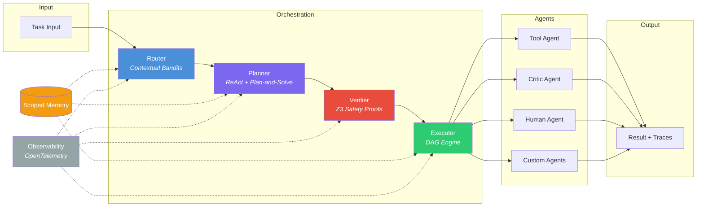

<div align="center">

# Lattice

**Adaptive Multi-Agent Orchestration Framework**

Hierarchical multi-agent orchestration with learned routing, adaptive planning, and formal workflow verification.

[](https://www.python.org/downloads/)
[](LICENSE)
[](https://github.com/lattice-org/lattice/actions)
[](https://codecov.io/gh/lattice-org/lattice)

</div>

---

## Architecture



## Features

| Feature | Description |
|---|---|
| **Learned Routing** | Contextual bandit router (epsilon-greedy, UCB, Thompson sampling) that learns optimal agent assignment from task embeddings and execution feedback |
| **Adaptive Planning** | Hybrid ReAct + Plan-and-Solve planner with Voyager-style skill caching. Auto-selects strategy based on estimated task complexity |
| **Formal Verification** | Z3-based safety verification checks DAG acyclicity, budget feasibility, capability matching, and custom policies before any execution |
| **DAG Execution** | Topological execution engine with dependency tracking, parallel dispatch, configurable concurrency, retry with backoff, and timeout |
| **Scoped Memory** | Hierarchical shared memory with namespace inheritance, TTL expiration, semantic search, and optional Redis persistence |
| **Token Streaming** | Async token-level streaming with backpressure, multi-consumer fan-out, and real-time statistics |
| **Checkpointing** | Execution checkpoints for fault recovery -- resume failed plans from the last successful step |
| **Cost Attribution** | Per-agent, per-model cost tracking with budget monitoring and alerts. Supports 100+ models via LiteLLM |
| **OpenTelemetry** | Full distributed tracing with Lattice-specific span attributes. Export to Jaeger, Honeycomb, or any OTLP collector |
| **Constitutional Critic** | Evaluation agent that scores outputs against configurable principles (helpfulness, accuracy, safety, coherence) |
| **Human-in-the-Loop** | Queue-based human approval agent with timeout, pre-loaded responses for testing, and audit logging |

## Quick Start

### Installation

```bash
pip install lattice
```

Or install from source:

```bash
git clone https://github.com/lattice-org/lattice.git
cd lattice
pip install -e ".[dev]"
```

### Minimal Example

```python
import asyncio
import numpy as np
from lattice import Router, Planner, Verifier, Executor
from lattice.agents.base import AgentResult, BaseAgent

# Define an agent
class MyAgent(BaseAgent):
    async def execute(self, task, context=None):
        return AgentResult(
            agent_id=self.agent_id,
            task=task,
            output=f"Completed: {task}",
        )

async def main():
    agent = MyAgent(agent_id="my_agent", name="My Agent")

    # Route -> Plan -> Verify -> Execute
    router = Router(agents=[agent], embedding_dim=384)
    planner = Planner()
    verifier = Verifier()
    executor = Executor(agents={"my_agent": agent})

    # Route a task
    embedding = np.random.randn(384).astype(np.float32)
    decision = await router.route(embedding)

    # Plan execution
    plan = await planner.plan(
        task="Analyze the quarterly report",
        available_agents=[decision.agent_id],
    )

    # Verify safety
    check = await verifier.verify_plan(plan)
    assert check.is_safe

    # Execute
    result = await executor.execute(plan)
    print(result.status, result.total_cost_usd)

asyncio.run(main())
```

See [`examples/`](examples/) for more complete examples:
- [`quickstart.py`](examples/quickstart.py) -- Full pipeline walkthrough
- [`multi_agent_research.py`](examples/multi_agent_research.py) -- Multi-agent DAG with critic
- [`verified_workflow.py`](examples/verified_workflow.py) -- Z3 verification demos

## Paper Implementations

Lattice implements ideas from the following papers:

| Paper | What We Use |
|---|---|
| **Voyager** (Wang et al., 2023) -- *An Open-Ended Embodied Agent with Large Language Models* | Skill library pattern: successful plans are cached and reused for similar future tasks via the memory system |
| **Plan-and-Solve** (Wang et al., 2023) -- *Plan-and-Solve Prompting: Improving Zero-Shot Chain-of-Thought Reasoning* | High-level task decomposition into ordered sub-goals with dependency edges, forming a DAG for the executor |
| **ReAct** (Yao et al., 2023) -- *ReAct: Synergizing Reasoning and Acting in Language Models* | Interleaved thought-action-observation loops for tool-using agents and fine-grained execution planning |
| **Contextual Bandits** (Agarwal et al., 2014) -- *Taming the Monster: A Fast and Simple Algorithm for Contextual Bandits* | Learned routing via reward prediction on task embeddings with epsilon-greedy, UCB, and Thompson exploration |
| **Constitutional AI** (Bai et al., 2022) -- *Constitutional AI: Harmlessness from AI Feedback* | Critic agent that evaluates outputs against configurable principles with weighted scoring and revision suggestions |

## Benchmarks

Measured on Apple M2 Pro, Python 3.12, single process:

| Benchmark | Value |
|---|---|
| Router decision latency (p50) | ~50 us |
| Router decision latency (p95) | ~120 us |
| Reward convergence (500 rounds) | >0.85 mean |
| DAG execution (10 parallel steps) | ~15 ms |
| DAG execution (20 sequential steps) | ~45 ms |
| Memory set/get (in-process) | ~5 us |
| Z3 verification (3-step plan) | ~2 ms |

Run benchmarks yourself:

```bash
python benchmarks/routing_benchmark.py
python benchmarks/throughput_benchmark.py
```

## Development

```bash
# Install dev dependencies
pip install -e ".[dev]"

# Run tests
pytest tests/ -v

# Run linter
ruff check src/ tests/

# Run type checker
mypy src/lattice/

# Run a single test file
pytest tests/test_router.py -v
```

## Project Structure

```
src/lattice/
    core/           Router, Planner, Executor, Verifier, Memory
    agents/         BaseAgent, ToolAgent, CriticAgent, HumanAgent
    routing/        TaskClassifier, TaskEmbedder, FeedbackProcessor
    verification/   Invariants, Z3SolverWrapper, Policies
    execution/      DAGBuilder, TokenStream, CheckpointManager
    observability/  TracingManager, MetricsCollector, StructuredLogger
    integrations/   OpenAI, Anthropic, LiteLLM providers
```

## License

[MIT](LICENSE)
